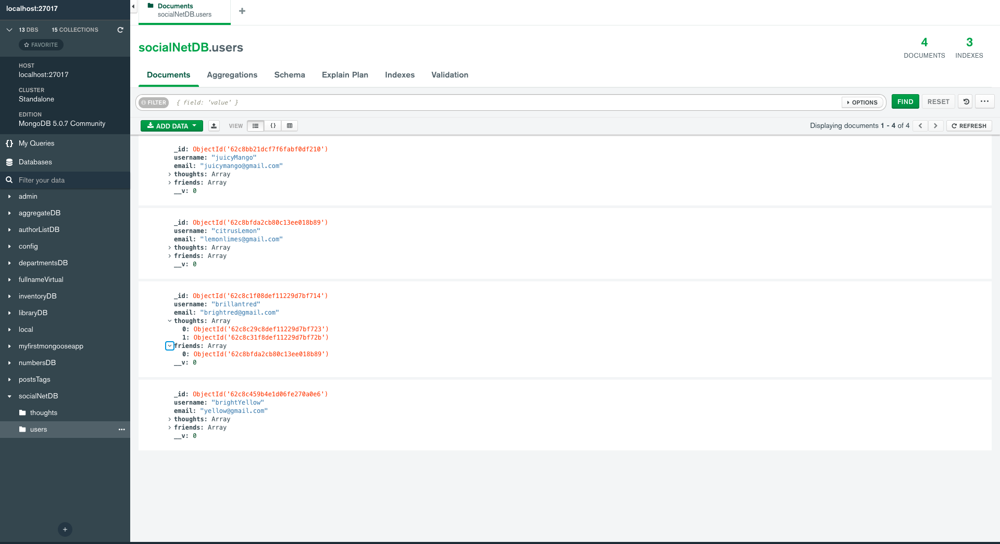
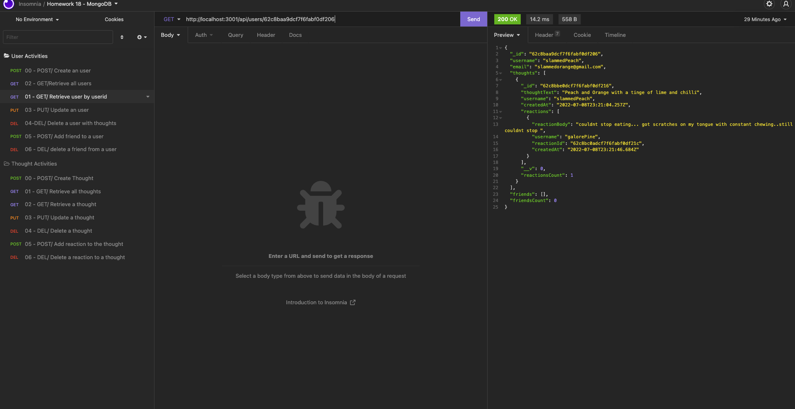

# Social Network Data Modeling 

This is Node application with a set of APIs for a social network web application where users can share their thoughts, react to friends’ thoughts, and create a friend list. These APIs have a full suite CRUD operations to add, query, update and delete users, friends, thoughts and reactions using express routes. As it is social network data, this data modeling is done using the Mongo DB. The data modeling and manipulation is done with Mongoose package. 

## Application details

Repo : https://github.com/rajeswarivmarimuthu/social-networking

## Tech Stack
- Node.js
- MongoDB
- npm packages
    - [Mongoose](https://www.npmjs.com/package/mongoose) for ODM (object document Mapping)
    - [Express.js](https://www.npmjs.com/package/express) for Routing 

## Usage

This application is not published anywhere yet. Only way to use it for now is to clone/fork it to local to use it. Once cloned to local, execute this application using 'node index.js' and use [insomnia](https://insomnia.rest/download) to play around with API.

## License
Licensed under the MIT license!

## Demo
Screen Shot of Data in Mongo

Screen Shot of Retrieve User by user id

Watch the full demo [video here](https://youtu.be/OmhH74U3YjM).